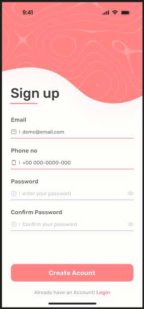
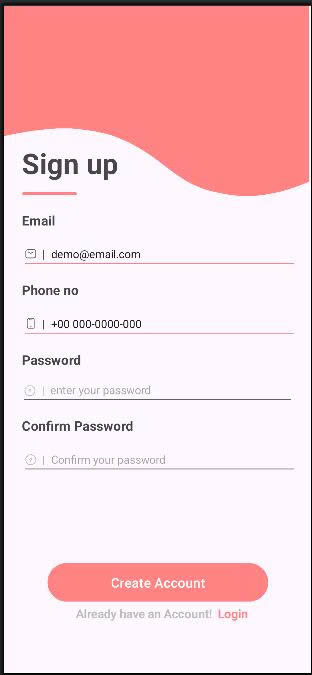

# BTAndroid65CLC
Homeword in Class

## 🌐Socials
 

# 💻Tech Stack
         	  
# 📊GitHub Stats :
 
 

## 🏆GitHub Trophies

### ✍️Random Dev Quote

### 😂Random Dev Meme

---

## Làm quen Android Studio bằng [HelloAndroid](https://github.com/NguyenTanDat1105/BTAndroid65CLC/tree/main/HelloAndroid)
- Đây là bài làm demo đầu tiên để làm quen với Android Studio với dự án đơn giản để hiển thị chữ Hello Android

## Làm quen với Layout [Vidu_Layout1](https://github.com/NguyenTanDat1105/BTAndroid65CLC/tree/main/VDLayout1) và [Vidu_Layout2](https://github.com/NguyenTanDat1105/BTAndroid65CLC/tree/main/VDLayout2)
- Đây là một cái example cho Layout

## [LoginScreenFigma](https://github.com/NguyenTanDat1105/BTAndroid65CLC/tree/main/LoginScreenFigma) và [AboutMe](https://github.com/NguyenTanDat1105/BTAndroid65CLC/tree/main/AboutMe)
- Đây là bài tập thiết kế giao diện về giới thiệu bản thân theo mẫu [Figma](https://www.figma.com/design/lN2orSHpfyD5x0WH8lOCm4/Untitled?node-id=0-1&p=f&t=NwT1K0EAuj3GDgPe-0)
- LoginScreen
  + Giao diện gốc và giao diện khi làm:
    |Gốc|Đã làm|
    |---|------|
    ||||
